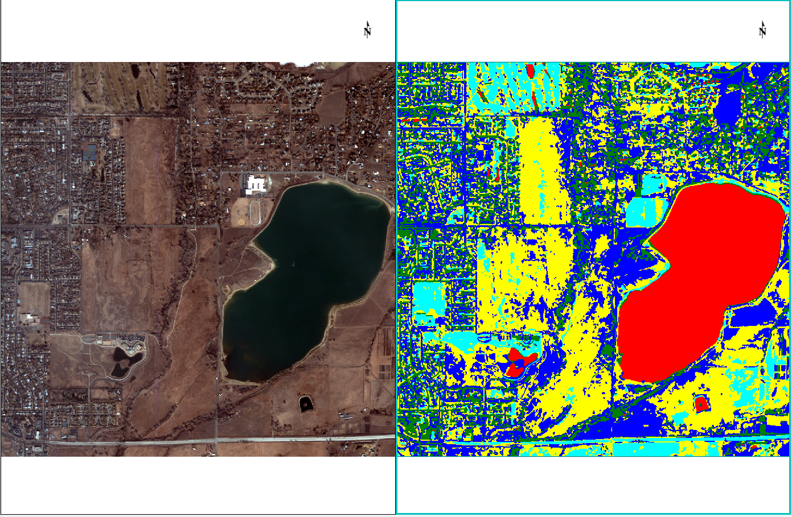

<a name="envi-idl-tasks"></a>

# ENVI and IDL Tasks

---


## Introduction

For this chapter we will cover the basics of tasks, ranging from what they are, how to use them, and how to create custom tasks of your own. Before we get into the specifics for creating custom tasks, let's go into more detail about what tasks are, the process for creating them, and what benefits they offer.

See the section ![SECTION:Tips for Creating Tasks] at the bottom of the chapter for some helpful pointers when writing tasks.


### Required Tools

- Windows workstation

- ![VERSION:ENVI] or newer


### What is a Task?

In general, tasks are components of processing that can be consumed by ENVI, IDL ,or GSF (Geospatial Services Framework). Tasks are **standardized** so that they are easy for end-users to understand and learn how to use. They also offer many other benefits, such as being able to generate dynamic widget programs and creating a simple utility for learning about different task parameters.

In addition to this, tasks can also be thought of as the most basic chunks of processing for some IDL routine or analytic. This is the most important function of the task because it allows for users to re-use the task anywhere that it might fit in. For example: in ENVI there are several workflows that allow for cleaning up classification rasters. For these cleanup tools you might see classification aggregation or classification smoothing as an option. For each one of these options there is a task used behind the scenes to process your data and, because they are tasks, these task can be re-used by any IDL/ENVI programmer.


### How are Tasks Created?

Before delving into the specifics behind ENVI and IDL tasks let's, talk about the typical workflow for developing a task (whether it is an ENVI task or an IDL task). These steps are meant to help guide those unfamiliar with tasks and are meant as guidelines. These steps are not required, but following some set of steps like this will help reduce errors in the code and decrease the time it takes to get from PRO code to a task.

Note that we will discuss these later on in this chapter in much greater detail .

1. Start with a procedure in IDL for developing the program or analytic to solve your problem.

2. Once you have the code together, expose the most important inputs and outputs as keywords in the procedure. A good idea for a naming convention might be prefixing **INPUT** or **OUTPUT** to each keyword to signify the directionality of the item.

3. Test the code as a procedure to make sure that it works correctly.

4. Create a task definition for the procedure and test the task with IDL.

5. Install the task files and create an IDL program to run the tasks once they are complete.

    From here, you can run ENVI tasks with something like the following in IDL;

    ```idl
    IDL> e = envi(/HEADLESS)
    ENVI> myENVITask = ENVITask('CustomTask')
    ENVI> myENVITask.INPUT_RASTER = e.openraster('C:\data\myRaster.dat')
    ENVI> myENVITask.execute
    ```
    and you can run IDL tasks with a similar object API

    ```idl
    IDL> myIDLTask = IDLTask('CustomTask')
    IDL> myIDLTask.INPUT_DATA = datArr
    IDL> myIDLTask.execute
    ```


For this chapter we are going to cover ENVI tasks, IDL tasks, and the differences/similarities between both of them. First we will start with ENVI Tasks.


### Important Note

<div class="callout callout-info">

Later in this chapter we are going to be installing the custom tasks for ENVI and IDL in ENVI's installation directory. You will need to have administrator permissions to create files in this location which is:

- For tasks (also called custom code): **![DIR:ENVI-TASKS]**

- For extensions: **![DIR:ENVI-EXTENSIONS]**

If you do not have administrator rights on your machine, you can access the alternative location for task/extension installation by opening ENVI and going to **File->Preferences->Directories** and viewing the path for **Custom Code Directory** and **Extensions Directory** . Tasks go into the Custom Code directory and extensions go into the Extensions directory.

</div>


## ENVI Tasks

The ENVI API provides numerous data processing routines called ENVI tasks. Each task is an IDL procedure that performs a specific data processing function and accepts the same input parameters as the corresponding menu item in the ENVI user interface. For example, the **ENVIISODATAClassificationTask** implements the ISODATA unsupervised classification algorithm. 

There are several categories of ENVI tasks:

- Change Detection
- Classification
- Color Slices
- Filters (Adaptive)
- Filters (Convolution)
- Georeferencing and Grids
- Image Registration
- Image Thresholds
- Masks
- Mosaics
- Point Clouds
- Preprocessing
- Raster Series
- ROIs and Vectors
- Spectral Tools
- Stretches
- Subsets
- Transforms
- Other

The ENVI API also allows for development of custom ENVI tasks as well. Custom tasks can, and often do, include other ENVI tasks. Custom workflows, extensions, and batch processing scripts are most often created by combining one or more ENVI tasks. ENVI tasks are also used by the taskengine to run at the command-line and with the ENVI Services Engine via GSF (Geospatial Services Framework). The following sections of this module will describe how to create, deploy, and use ENVI tasks.

<div class="callout callout-info">
When you see ```idl envi(/HEADLESS)``` below, that means that ENVI is being started without the user interface present. This is typically done for batch processing or when you want access to the routines in ENVI, but don't need the interface. If the ENVI interface is already up and running another session of ENVI will not be started. Instead, IDL will return a reference to the current session of ENVI.
</div>

A list of the available ENVI Tasks can be obtained using the following lines:

```idl
IDL> e = envi(/HEADLESS)
ENVI> taskNames = e.TASK_NAMES
ENVI> print, taskNames
```

We won't include the output from running the above command because the list would be very long. At the time this chapter was written there were about 175 custom tasks in ENVI. Each ENVI Task is implemented as an IDL procedure with keyword parameters. An object instance of an ENVI Task can be obtained by using the ```idl ENVITask()``` function and providing the name of the desired task. For example, to get an instance of the `SpectralIndex` task, use the following commands:

```idl 
IDL> e = envi(/HEADLESS)
ENVI> SpecindTask = ENVITask('SpectralIndex')
```

Each task has a set of methods that are common to all methods, such as the ```idl task.execute``` method and a set of methods that are unique to that particular task. Each task also has a set of properties that are applied (set) only during the initial creation of the object instance. These are marked as *Init* properties. Properties that can only be retrieved are marked as *Get*. Those properties that can be set and get can be modified during the initial creation of the object or modified after creation.

An ENVI Task's input and output keyword parameters are indicated in the corresponding task definition file. The names of input and output parameters can be obtained using

```idl
ENVI> params = SpecIndTask.ParameterNames()
ENVI> params
!CONSOLE input_raster
!CONSOLE index
!CONSOLE output_raster
!CONSOLE output_raster_uri
```

In addition, the names of the input and output parameters, information about each parameter, and notes about the task can be obtained by printing the task in the IDL console:

```idl
ENVI> SpecIndTask
!CONSOLE ENVISPECTRALINDEXTASK <422846>
!CONSOLE  NAME                      = 'SpectralIndex'
!CONSOLE  DISPLAY_NAME              = 'Spectral Index'
!CONSOLE  DESCRIPTION               = 'This task creates a spectral index raster from one pre-defined spectral index. Spectral indices are combinations of surface reflectance at two or more wavelengths that indicate relative abundance of features of interest.'
!CONSOLE  COMMUTE_ON_DOWNSAMPLE     = 'Unknown'
!CONSOLE  COMMUTE_ON_SUBSET         = 'Unknown'
!CONSOLE  ROUTINE                   = 'ENVISpectralIndexRaster'
!CONSOLE  INPUT_RASTER
!CONSOLE    DEFAULT                   = !NULL
!CONSOLE    DESCRIPTION               = 'Specify a raster from which to generate a spectral index raster.'
!CONSOLE    DIRECTION                 = 'INPUT'
!CONSOLE    DISPLAY_NAME              = 'Input Raster'
!CONSOLE    NAME                      = 'INPUT_RASTER'
!CONSOLE    REQUIRED                  = 1
!CONSOLE    TYPE                      = 'ENVIRASTER'
!CONSOLE    VALUE                     = !NULL
!CONSOLE  INDEX
!CONSOLE    CHOICE_LIST               = 'Anthocyanin Reflectance Index 1', 'Anthocyanin Reflectance Index 2', 'Atmospherically Resistant Vegetation Index', 'Burn Area Index', 'Carotenoid Reflectance Index 1', 'Carotenoid Reflectance Index 2', ...
!CONSOLE    DEFAULT                   = !NULL
!CONSOLE    DESCRIPTION               = 'Specify a string representing the pre-defined spectral index to apply to the input raster.'
!CONSOLE    DIRECTION                 = 'INPUT'
!CONSOLE    DISPLAY_NAME              = 'Index'
!CONSOLE    FOLD_CASE                 = 1
!CONSOLE    NAME                      = 'INDEX'
!CONSOLE    REQUIRED                  = 1
!CONSOLE    TYPE                      = 'STRING'
!CONSOLE    VALUE                     = !NULL
!CONSOLE  OUTPUT_RASTER
!CONSOLE    DEFAULT                   = !NULL
!CONSOLE    DESCRIPTION               = 'This is a reference to the output raster of filetype ENVI.'
!CONSOLE    DIRECTION                 = 'OUTPUT'
!CONSOLE    DISPLAY_NAME              = 'Output Raster'
!CONSOLE    NAME                      = 'OUTPUT_RASTER'
!CONSOLE    REQUIRED                  = 1
!CONSOLE    TYPE                      = 'ENVIRASTER'
!CONSOLE    VALUE                     = !NULL
!CONSOLE  OUTPUT_RASTER_URI
!CONSOLE    AUTO_EXTENSION            = '.dat'
!CONSOLE    CHOICE_LIST               = !NULL
!CONSOLE    DEFAULT                   = !NULL
!CONSOLE    DESCRIPTION               = 'Specify a string with the fully-qualified path and filename for OUTPUT_RASTER.'
!CONSOLE    DIRECTION                 = 'INPUT'
!CONSOLE    DISPLAY_NAME              = 'Output Raster URI'
!CONSOLE    FOLD_CASE                 = 1
!CONSOLE    IS_DIRECTORY              = 0
!CONSOLE    IS_TEMPORARY              = 1
!CONSOLE    NAME                      = 'OUTPUT_RASTER_URI'
!CONSOLE    REQUIRED                  = 0
!CONSOLE    TYPE                      = 'ENVIURI'
!CONSOLE    VALUE                     = !NULL
```

Here is a short description the properties that the `INDEX` parameter has for our SpectralIndex task.

- The `CHOICE_LIST` field provides a list of the available Spectral Indices.
- The `DEFAULT` field list the default value if the property is optional. This value will be used unless you set a different value.
- The `DESCRIPTION` field provides a descriptive definition of the property
- The `DIRECTION` field indicates if the propety is used for input or output
- The `DISPLAY_NAME` field indicates the name of the property when printed
- The `NAME` field is the valid string to use when referring to the property in subsequent steps
- The `REQUIRED` field is set to 1 if the property is required to run the taks, or 0 if it is optional
- The `TYPE` field describes the IDL data type for the property

Apart from tasks helping expose information about what is going to be processed, there are other useful features which are built in to task parameters.


### Task Parameters

Each ENVITask has a set of required parameters (also called properties), each of which has constraints on data type, values, etc. Most tasks have an INPUT_RASTER or INPUT_VECTOR property, depending on whether the task is designed for image or vector processing. Most of these properties which are required for processing must be specified in order for the task to successfully run. This is intentional behavior and is a great tool to speed up development for algorithms. 

Typically, if you are writing your own IDL code with many inputs and outputs, then you will need to spend some time checking to make sure that the correct information has been passed in. This could be for checking data type, number or array elements, seeing if the parameter has been set, setting default values, etc. ENVITasks remove this burden from the programmer and do all of the heavy lifting for the user. Here is an example using the SpectralIndex task that will not allow the user to execute the processing because two required parameters have not been set. 

<div class="callout callout-info">

Note: If you don't set a required property before running a task, you will see an error like the following when trying to execute a task.

```idl
ENVI> SpecIndTask.execute
!NOCOLOR % Invalid parameter named "INPUT_RASTER":
!NOCOLOR       Required parameter has no VALUE or DEFAULT property set.
!NOCOLOR     Invalid parameter named "INDEX":
!NOCOLOR       Required parameter has no VALUE or DEFAULT property set.
!NOCOLOR % Execution halted at: $MAIN$          
```

To check and see if you need to specify a parameter in order to run a task, you can check the `REQUIRED` property for the task parameter.

</div>

You also have the ability to grab certain parameters and validate them manually in your code.

```idl
ENVI> ; Get the radiometric calibration task from the catalog of ENVI tasks
ENVI> task = ENVITask('RadiometricCalibration')

ENVI> ; Validate the OUTPUT_DATA_TYPE property to see if its value is valid,
ENVI> ; before running the task
ENVI> param = task.Parameter('OUTPUT_DATA_TYPE') ; this is the ENVITaskParameter object
ENVI> result = param.Validate('Int', VALIDATION_EXCEPTION=msg)
ENVI> print, result
!CONSOLE 1
```idl

We see that in the above example the value of `result` is 1, which also signifies true in IDL. We can interpret this as the task parameter was validated. You can also cause a task parameter to be invalid which will generate a text error in addition to the value of `result` changing to 0 for false.


```idl
ENVI> ;set OUTPUT_DATA_TYPE to a bad value:
ENVI> result = param.Validate('Byte', VALIDATION_EXCEPTION = msg)
ENVI> print, result
!CONSOLE 0
ENVI> print, msg
!CONSOLE Parameter OUTPUT_DATA_TYPE failed validation: Value not found in CHOICE_LIST: Byte.
```

There are other ways that validation helps make tasks easy to use apart from making sure a selected parameter is on the available list of parameters that can be used. One of the more useful components of validation is making sure that a set data type is correct.

Using the Spectralindex task, let's take a closer look at the parameter `INPUT_RASTER`.

```idl
ENVI> SpecIndTask.parameter('INPUT_RASTER')
!CONSOLE ENVITASKPARAMETER <423000>
!CONSOLE   DEFAULT                   = !NULL
!CONSOLE   DESCRIPTION               = 'Specify a raster from which to generate a spectral index raster.'
!CONSOLE   DIRECTION                 = 'INPUT'
!CONSOLE   DISPLAY_NAME              = 'Input Raster'
!CONSOLE   NAME                      = 'INPUT_RASTER'
!CONSOLE   REQUIRED                  = 1
!CONSOLE   TYPE                      = 'ENVIRASTER'
!CONSOLE   VALUE                     = !NULL
```

For this task parameter an ENVIRaster must be passed as input. Let's see what happend when we incorrectly set the value of a parameter

```idl
ENVI> SpecIndTask.INPUT_RASTER = 42
!NOCOLOR % Parameter INPUT_RASTER failed validation: Value must be a scalar ENVIRASTER.
!NOCOLOR % Execution halted at: $MAIN$    
```

ENVI is smart enough to know that we tried to set a scalar number where we need a scalar ENVIRaster for our input. 


### Running an ENVI Task

It is very easy to run an ENVI task from IDL. All that you need to do is invoke the ```idl task.execute``` method for the after the task object is created. Below is an example taken from the documentation for the `SpectralIndices` task.

```idl
; Open an input file
File = Filepath('qb_boulder_msi', Subdir=['data'], $
  Root_Dir=e.Root_Dir)
Raster = e.OpenRaster(File)
 
; Process a spatial subset
Subset = ENVISubsetRaster(Raster, Sub_Rect=[600,200,799,399])
 
; Get the task from the catalog of ENVITasks
Task = ENVITask('SpectralIndices')
 
; Define inputs
Task.INDEX = ['Normalized Difference Vegetation Index', $
  'Visible Atmospherically Resistant Index']
Task.INPUT_RASTER = Subset
 
; Define outputs
Task.OUTPUT_RASTER_URI = e.GetTemporaryFilename()
 
; Run the task
Task.Execute
```


### Specifying Task Outputs

For most tasks that you run from IDL, after the processing is complete you should get some file written to disk. Whether that output is a shapefile, raster, or ROI, it is useful to be able to specify the output filename and location when processing with ENVI's API.

To set the output in an ENVI task, when appropriate, tasks should have a parameter with a name that starts with `OUTPUT_`. For example, most tasks have `OUTPUT_RASTER_URI` because ENVI is processing imagery. If you don't care about the output filename then you can manually set a temporary filename for the output of a task.

```idl
task.OUTPUT_RASTER_URI = e.GetTemporaryfilename()
```

The default location for the temporary files, unless changed in ENVI's settings, is **C:\\Users\\userName\\AppData\\Local\\Temp**. As a shortcut in case you don't remember the name, you can type `%TEMP%` in Windows Explorer and arrive at the same location.

<div class="callout callout-info">

When you don't set the output URI's for task parameters, ENVI is smart enough to provide a temporary filename in it's place.

With the SpectralIndices task example above, we could have just called the task with

```idl
; Get the task from the catalog of ENVITasks
Task = ENVITask('SpectralIndices')
 
; Define inputs
Task.INDEX = ['Normalized Difference Vegetation Index', $
  'Visible Atmospherically Resistant Index']
Task.INPUT_RASTER = Subset

; Run the task
Task.Execute
```

That saves a few lines of code and ENVI handles all of the file naming. This is very convenient when we don't care about output because we can manually delete the files in the temporary directory after we are done processing.

</div>

### A Small Example Tying Tasks Together

Here is a code sample for how you can use multiple tasks together by typing the outputs from one task to the inputs of another. With this example we just let ENVI handle all of the output file naming.


```idl
; Start the application
e = ENVI()

; Get the collection of data objects currently available in the Data Manager
DataColl = e.Data

; Open an input file
File = Filepath('qb_boulder_msi', SUBDIR = ['data'], $
  ROOT_DIR = e.Root_Dir)
Raster = e.OpenRaster(File)
 
; Process a spatial subset
Subset = ENVISubsetRaster(Raster, SUB_RECT = [600,200,799,399])
 
; Create a classification ENVIRaster
; Get the task from the catalog of ENVITasks
Task = ENVITask('ISODATAClassification')
 
; Define inputs
Task.INPUT_RASTER = Subset

; Run the task
Task.Execute
 
; Get the task from the catalog of ENVITasks
SievingTask=ENVITask('ClassificationSieving')
 
; Define inputs
SievingTask.INPUT_RASTER = Task.OUTPUT_RASTER
 
; Run the sieving task
SievingTask.Execute
 
; Get the clumping task
ClumpingTask = ENVITask('ClassificationClumping')
 
; Define inputs
ClumpingTask.INPUT_RASTER = SievingTask.OUTPUT_RASTER

; Run the task
ClumpingTask.Execute
 
; Add the output to the Data Manager
DataColl.Add, ClumpingTask.OUTPUT_RASTER
 
; Display the result
Layer2 = View1.CreateLayer(ClumpingTask.OUTPUT_RASTER)
 
; Flicker between the original classification and the result
; after clumping
Portal = View1.CreatePortal()
Portal.Animate, 2.0, /FLICKER
```

This example performs the following tasks:

1. ISODataClassification for classifying an image
2. ClassificationSieving to throw out small clumps of pixels
3. ClassificationAggregation to join smaller regions with larger ones.

In addition to running the tasks, the example also uses ENVI's API to display the results in ENVI. If you have started ENVI headlessly then an error will be thrown while trying to access elements of ENVI's UI.


## Exercise #1: Creating a Custom ENVI Task

Apart from understanding how to work with tasks in ENVI, a very important skill is the ability to create your own custom task. one common use for this is actually making a task that wraps several tasks for a small, custom workflow that can be easily delivered to a coworker or customer.

Altogether, our custom task will do the following:

1. ISODataClassification for classifying an image.
2. ClassificationSmoothing to remove speckling noise from the classification.
3. ClassificationSieving to throw out small clumps of pixels.
4. ClassificationAggregation to join smaller regions with larger ones.

### Step 1: Creating a Procedure

The first step to for creating a custom task is to create an IDL procedure that contains all of the code that you want your task to run. For this example we will be using ENVI + IDL to wrap some classification and classification cleanup tasks so that we can have a quick workflow. We will be extending the example we showed above with our multiple tasks being chained together. 

The source code file is named **classify_raster.pro** and can be found in the corresponding directory for this chapter in the web version of this course.


At this point, let's go ahead and save this to the directory


### Step 2: Creating a Task File

Each ENVI task is associated with an accompanying JSON file that describes the input and output parameters. The easiest way to describe how to create a task file is to show an example of one. Below you will find the task file for the PRO code that we have shown above. 


The Task Keys section contains keys which have the following meaning. Note that these task keys are based off of ENVI 5.3 tasks. This is because ENVI 5.4 was recently released and not all users have upgraded to the latest and greatest version. 

-------------------------------------------------------------------------------------
Key                   Description
--------------------- ---------------------------------------------------------------
name                  A string with the name of the task. This name is used when 
                      calling the ENVITask function to create an instance of the 
                      task. This key is required if storing the task definition 
                      to disk. The name of the task file must match the value of 
                      this key and must be a valid IDL variable name.

baseClass             A string with the name of the class to use; the most 
                      common is ENVITaskFromProcedure. This key is required.

version               For ENVI 5.3, tasks that are created need a string that
                      indicates what version of ENVI they were created with.
                      This should be set to "5.3" for task that are before
                      ENVI 5.4.

routine               The routine that is called when Task.Execute is invoked. 
                      This key is required when used with ENVITaskFromProcedure.

displayName           A string with the name of the task for display purposes. 
                      Spaces and special characters are allowed.

description           A string with a description of the task.

parameters            A LIST of HASHs of key/value pairs, described in the 
                      Parameter Keys table below.
-------------------------------------------------------------------------------------

Table: Task keys for ENVI 5.3 tasks


The Parameter Keys section describes each input/output parameter. The keys for this section have the following meaning. There is also some additional information below the table regarding the **dataType** parameter.

------------------------------------------------------------------------------------------
Key                   Description
--------------------- --------------------------------------------------------------------
name                  The name of the parameter as it appears to the end user. This 
                      key is required and must be a valid IDL variable name.

dataType              A scalar string indicating the parameter type to use on 
                      creating an instance of the task. This key is required. See 
                      below for more information.

keyword               The internal keyword that the parameter should map to when 
                      invoking the routine. If it is the same as the name key, then 
                      you do not need to create this key.

displayName           A string with the name of the parameter for display purposes. 
                      Spaces and special characters are allowed.

description           A string with a description of the parameter.

direction             Specify if the parameter is input or output. If this key is not 
                      set, then direction defaults to input.

parameterType         A string value that indicates whether the parameter is 
                      required or not. This can be "required" or "optional".

defaultValue          The default value of the parameter if the end user does not 
                      provide a value.

choiceList            Set this to an array (strings or numbers) of potential 
                      values that a user can set this parameter to.

min                   If the type of the parameter is a number, then you can specify
                      a minimum value that the parameter can be set to.

max                   If the type of the parameter is a number, then you can specify
                      the maximum value that the parameter can be set to.
------------------------------------------------------------------------------------------

Table: ENVI 5.3 task parameter keys 


Here is some additional information on **dataType** with regards to the table above:

- dataType

    Basic scalar data type string values are:

    BYTE, INT, UINT, LONG, ULONG, LONG64,ULONG64, FLOAT, DOUBLE, COMPLEX, DCOMPLEX, STRING, BOOLEAN, LIST, HASH, DICTIONARY, ORDEREDHASH

    Basic array data types must include the dimensions key and type string values are:

    BYTEARRAY, INTARRAY, UINTARRAY, LONGARRAY, ULONGARRAY, LONG64ARRAY,ULONG64ARRAY, FLOATARRAY, DOUBLEARRAY, COMPLEXARRAY, DCOMPLEXARRAY, STRINGARRAY, BOOLEANARRAY

    If you want to specify the size of the array that you are allowing a user to pass in, then you can use syntax like "BYTEARRAY[2,2]", where the array dimensions come after the string of the data type. For unrestricted array dimensions, use the asterisk like "INTARR[*]".

    The type key value can be set to a class name to indicate that the user must provide an object of the given class name. This is very useful for the objects ENVIRASTER, ENVIVECTOR, and ENVIROI. There are also addition ENVI objects that are compatible with ENVI 5.3 tasks, but these are the most common


Most of the keys are used for each parameter, but not necessarily all. 

Let's take a closer look at this JSON file and explain how the JSON and PRO code are tied together. For each keyword, we also have a corresponding entry in our parameters section of our task file. The keyword `INPUT_RASTER` is mapped to the `INPUT_RASTER` parameter and the `OUTPUT_RASTER_URI` keyword is mapped to the `OUTPUT_RASTER` task parameter.

<div class="callout callout-info">

Note how the OUTPUT_RASTER parameters do not have the same name. These are called paired parameters and are special to ENVI datatypes that require files on disk. This works when you have a task parameter that is an ENVI object, in this case it is an ENVIRASTER. For this case, ENVI expects a keyword called OUTPUT_RASTER_URI in the PRO code. When the task is executed, ENVI recognizes that this OUTPUT_RASTER_URI should be an ENVIRASTER, so ENVI opens the file as a raster which you have access to in the task object.

This behavior is used because this task was written using ENVI 5.3. Although we now have ![VERSION:ENVI], this task style is still used sometimes to offer backwards compatibility with users who are on older versions of ENVI + IDL.

</div>

### Step 3: Install the Custom Task

ENVI searches the following directories and their subdirectories for custom tasks:

- ![DIR:ENVI-TASKS] : **You must have admin rights to save the tasks here**
- ![DIR:ENVI-TASKS-USER]

There are two separate options because some users might not have admin rights on the computers that they use. If you don't have admin rights, then the tasks that you install will only be for the current user of the computer. Tasks that are put into the first location listed above, will be accessible by all users of the machine. If you are installing tasks for use with GSF, then you **should** install them in the first location.

<div class="callout callout-info">

If you save your task files in the correct location, then you will need to have any program for editing the files to be started with admin rights in order to be able to save the changes to your tasks. It is easiest to do all testing as a user before pushing the tasks to the default location.

</div>

For installing the tasks, we don't want to just copy/paste the PRO code into the custom code directory because users will need to have an active IDL session to be able to compile and run the tasks. This is because, when ENVI is started separate from IDL, ENVI starts in  runtime which does not allow for compile code. This means we need to precompile all of our code ahead of time into IDL SAVE files.

SAVE files are compiled versions of PRO code that can be used in the same way as the PRO code. They also offer the advantage of people not being able to access your source code. This can be useful if you create a custom task with certain IP that you don't want other people to have access to, making them a great way to easily pass around code for others to use without them also having access to your IP.

In order to make a SAVE file, there are a few lines of IDL code that you will need to run

```idl
IDL> .reset
IDL> .compile classify_raster
IDL> resolve_all, /CONTINUE_ON_ERROR, SKIP_ROUTINES = ['ENVI', 'envi_doit']
IDL> save, FILENAME = 'classify_raster.sav', /ROUTINES
IDL> cd, CURRENT = current
IDL> print, 'File saved in directory : ' + current
!NOCOLOR File saved in directory : C:\Users\norm3596
```

The above code will:

1. Reset our session to clean IDL session of other compiled code and variables

2. Compile our PRO code that we need for our task

3. Find and compile code that we run from within our procedure. This also skips certain routines (ENVI) and does not stop on an error.

4. Saves the compiled code to disk with the same base name as the source and a `.sav` file extension.

5. Prints the directory that the code is saved in. by default, if you don't specify the fully qualified filepath for the `FILE` keyword in ```idl save```, then the file is saved in IDL's current directory. Printing this here just helps remember where we need to go to get the SAVE file.

Once we have this code compiled and saved, let's go ahead and install the task in **![DIR:ENVI-TASKS]**.

To verify that we have done everything correctly, let's start ENVI back up and see if we have the task

```idl
IDL> e = envi()
ENVI> task = ENVITask('ClassifyRaster')
```

As long as we don't have an error here, let's go ahead and test this out with as raster, **qb_boulder_msi** that ships with ENVI. First, let's use ENVI's dynamic UI to select the raster we want to process. If the ENVI UI isn't up for you, go ahead and reset your IDL session and start up the ENVI interface.

```idl
ENVI> raster = e.ui.SelectInputData(/RASTER)
```

Click on the **Open** icon  and navigate to **![DIR:ENVI-DATA]**. Select **qb_boulder_msi** and select **OK**. As a sanity check to make sure that we actually opened our raster we should use ```idl help``` to see what our variable is.

```idl
ENVI> help, raster
!NOCOLOR RASTER          ENVIRASTER <319421>
```

If you don't see something similar to the output above in your session of IDL, try opening the raster again. 

Let's now run our custom task using the same task object we just created.

```idl
ENVI> task.INPUT_RASTER = raster
ENVI> task.execute
```

Once IDL finishes processing, take a look at ENVI's data manager. To open the data manager you can use the handy shortcut of `F4`. Do you see an additional raster apart from **qb_boulder_msi**? You shouldn't and that is expected. In order to have the raster added to ENVI's data collection (which is what the data manager represents), you need to do

```idl
ENVI> e.data.Add, task.OUTPUT_RASTER
```

and now you should see the raster in ENVI's data collection. Next let's display both rasters in ENVI and view them side by side with a link between them. First we will need to create two views and display a raster in each.

```idl
ENVI> view1 = e.GetView()
ENVI> layer1 = view1.CreateLayer(raster, /CLEAR_DISPLAY)

ENVI> view2 = e.CreateView()
ENVI> layer2 = view2.CreateLayer(task.OUTPUT_RASTER)
```

To link them correctly, we will zoom out to the full extent of each raster and then link them with ENVI's API.

```idl
ENVI> view1.Zoom, /FULL_EXTENT
ENVI> view2.Zoom, /FULL_EXTENT
ENVI> view2.geolink, /LINK_ALL, /ZOOM_LINK
```

Once you do this, you will see something like the following in ENVI:



The nice thing about being able to control ENVI from IDL is that you can automate all of the small steps we just took for displaying the images in ENVI. This is where you can start to get into ENVI extensions, but for now, congratulations because you just made your first custom task!


## IDL Tasks

In addition to just being able to create tasks for ENVI, you can also create custom IDL tasks. In general, these tasks also behave in the same way as ENVI tasks, but the set up is a little different. In order to create IDL tasks, you will need at least IDL 8.5.2 to do so which was when they were first introduced. Just like ENVI tasks, let's start out with the JSON task definition for an existing IDL task.

### IDL Task Definition


First, let's talk about the primary links in the JSON above. These are the main keys and include the name, schema, routine, and parameters.

-------------------------------------------------------------------------------------
Key                   Description
--------------------- ---------------------------------------------------------------
name                  A string with the name of the task. This name is used when 
                      calling the IDLTask function to create an instance of the 
                      task. This key is required if storing the task definition 
                      to disk. The name of the task file must match the value of 
                      this key and must be a valid IDL variable name.

base_class            A string with the name of the class to use; the most 
                      common is IDLTaskFromProcedure. This key is required.

schema                A string containing the schema of the task definition. The 
                      schema is: idltask_1.0 . IDL will support this schema in 
                      future releases if a new schema is introduced. 
                      This key is required.

routine               The routine that is called when Task.Execute is invoked. 
                      This key is required when used with IDLTaskFromProcedure.

display_name          A string with the name of the task for display purposes. 
                      Spaces and special characters are allowed.

description           A string with a description of the task.

parameters            A LIST of HASHs of key/value pairs, described in the 
                      Parameter Keys table below.
-------------------------------------------------------------------------------------

Table: Task keys for IDL tasks

The main difference between the IDL task keys and the ENVI task keys is the **schema** attribute. This is something that you can also introduce into ENVI tasks, but they won't be backward compatible with ENVI 5.3 if they have schema. Additionally, older tasks will not word with newer versions of ENVI if they are missing schema (for ![VERSION:ENVI] or newer) or missing version for tasks written for ENVI 5.3.

Apart from the main keys there are also the keys for the parameters which are listed under the task key **parameters**. These keys do differ from ENVI's parameter keys, so here is a table which highlights the differences. Below the table you will also find some additional information about the **type** and **size** keys, which have detailed information for how you can use them


------------------------------------------------------------------------------------------
Key                   Description
--------------------- --------------------------------------------------------------------
name                  The name of the parameter as it appears to the end user. This 
                      key is required and must be a valid IDL variable name.

type                  A scalar string indicating the parameter type to use on 
                      creating an instance of the task. This key is required. See 
                      below for more information.

dimensions            A scalar string specifying the required dimensions for a 
                      parameter, if type specified is an **ARRAY** type.

keyword               The internal keyword that the parameter should map to when 
                      invoking the routine. If it is the same as the name key, then 
                      you do not need to create this key.

display_name          A string with the name of the parameter for display purposes. 
                      Spaces and special characters are allowed.

description           A string with a description of the parameter.

direction             Specify if the parameter is input or output. If this key is not 
                      set, then direction defaults to input.

required              A boolean value that indicates whether the parameter is 
                      required or not. The default is false, which allows the 
                      parameter to be optional.

default               The default value of the parameter if the end user does not 
                      provide a value.

hidden                A boolean value that indicates whether the parameter is visible 
                      to the user or not. The default is false, which means the user 
                      can see it and set its value. Set this key to true if you want 
                      to prevent the user from seeing the parameter or changing its 
                      value. You must also set the default key to the desired value.

additional keys       Depending on the parameter there may be additional keys 
                      available to define. For example for a type set to STRING, there 
                      is fold_case and choice_list. You could use the 
                      `.QueryProperty()` static method on the given parameter class 
                      to discover the available keys
------------------------------------------------------------------------------------------

Table: IDL task parameter keys 

Here is some additional information on **type** and **size** with regards to the table above:

- type

    Basic scalar data type string values are:

    BYTE, INT, UINT, LONG, ULONG, LONG64,ULONG64, FLOAT, DOUBLE, COMPLEX, DCOMPLEX, STRING, BOOLEAN, LIST, HASH, DICTIONARY, ORDEREDHASH

    Basic array data types must include the dimensions key and type string values are:

    BYTEARRAY, INTARRAY, UINTARRAY, LONGARRAY, ULONGARRAY, LONG64ARRAY,ULONG64ARRAY, FLOATARRAY, DOUBLEARRAY, COMPLEXARRAY, DCOMPLEXARRAY, STRINGARRAY, BOOLEANARRAY,

    The type key value can be set to a class name to indicate that the user must provide an object of the given class name.

- dimensions

    If the number of elements in any dimension does not matter, then use an asterisk ('*') for that dimension.

    Example of a three-element array declaration: "[3]"

    Example of a 1D array with any number of elements: "[*]"

    Example of a 2D array with any number of columns or rows: "[*, *]"

    Example of a 2D array with a specific number of elements: "[3, 256]"

    Example of a 2D array with any number of columns and 3 rows: "[*, 3]"


<div class="callout callout-info">

For IDL tasks the **dimensions** parameter key is taken literally. If you try and pass in a four element array when the dimensions says you can have a three element array, then the task will fail validation.

This strict behavior constrains the tasks so that they are "user proof" which helps ensure that a task has the correct input needed to use it. This is important because, although you might develop a task a certain way, others might try to use your code in unexpected ways and IDl helps make sure that the task will not break if/when it is

</div>


### Installing IDL Tasks

IDL tasks are easier to install for a user than ENVI tasks because IDL has path searching capabilities that ENVI does not use when ENVI and IDL are separate from one another. For IDL, all you need to do is place the task file and PRO code on IDL's search path and IDL will find the code.

However, if you do want to install IDL tasks for multiple users then you will need admin rights to create a new directory in IDL's installation location. In addition to this, you could also alter IDL's preferences so that additional directories are searched on startup so that you wouldn't need to do this.

In order to test the addition task that we will use in the next section, make sure that you have these course materials added to IDL's search path. To do this, you can go to **Window -> Preferences -> IDL -> Paths** and select **insert** to add the course directory. Make sure that you also select the check box next to the directory so that it is recursively searched for PRO code and task files.


### Calling IDL Tasks

In order to call an IDL task you only need to use the ```idl IDLTask()``` function with the argument as the name of the task. Let's go ahead and call the addition task that was already created. 

```idl
IDL> task = IDLTask('addition')
IDL> task.A = 5
IDL> task.B = 10
IDL> task.execute
IDL> task.RESULT
!CONSOLE 15
```

This is a very simple example with an IDL task and is just meant to demonstrate the differences between ENVI and IDL tasks. The two task formats are very similar and, for most cases, custom tasks will be taking advantage of ENVI and that is why there is so much more detail on how to use ENVI tasks. 

If you would like to learn more about IDL tasks, search the web for "IDL tasks" and the first or second link should bring you to our online documentation. 


## Tips for Creating Tasks


Here are some tips for creating custom tasks:

- There is a lot of information to digest when first creating and working with tasks, especially within the ENVI API. The best place to find information is on our website, [www.harrisgeospatial.com](https://www.harrisgeospatial.com), and just browse through the help contents for the ENVI API. There are lots of links throughout the documentation that make it easy to find syntax for routines and examples that you can use.

- Task parameter names should be consistent among different tasks. Ideally, they should also have the same names as in your IDL procedure where applicable. This would mean that any raster that is an output raster from custom processing tasks should have `OUTPUT_RASTER` for the task parameter across different tasks.

- We recommend that you do not add spatial or spectral subsetting as parameters to custom tasks. Instead, subset your data using ```idl ENVISubsetRaster()```. When using this function ahead of time, you can subset spectrally and/or spatially at the same time. In addition to this, when using ENVI's dynamic UI, a user can spectrally subset, spatially subset, and add masks in the raster selection dialog similar to . 

- Style sheets are a new, useful addition to ENVI that can be used to customize the dynamic UI. For example, if your custom task includes a dynamic UI with a file selection dialog, you can prevent end users from subsetting raster data by setting the `DISABLE_SUBRECT` and `DISABLE_BANDS` keywords on the `ENVIRaster_UI` class.

- You can add progress bars to custom tasks. See ENV's method ```idl envi.GetBroadcastChannel()``` for a detailed example on how you can achieve this.

- Instead of using `ENVITaskFromProcedure` as the base class for custom tasks, you can write a custom base class that will automatically do some sort of pre/post processing when running code. See [Custom Task Base Classes](http://www.harrisgeospatial.com/docs/custombaseclasses.html) for more detail. This could save you time and from including the same code in multiple tasks that use the same pre/post processing steps.

- Organization is key! When you have a lot of tasks it is important to organize all of your code in such a way that you can remember what you need for certain tasks and so that others can easily understand your directory structures. One method to organize directories for tasks is:

    - Overall directory name, i.e. CustomTask

        - Subdirectory called **custom_code** containing all PRO code for running the task and the task file.

        - Subdirectory called **extension** containing the code for an ENVI extension.
